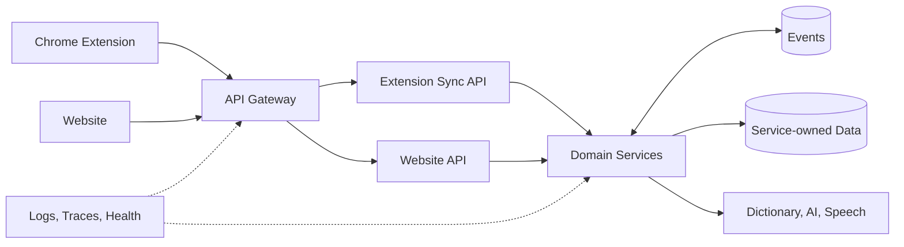
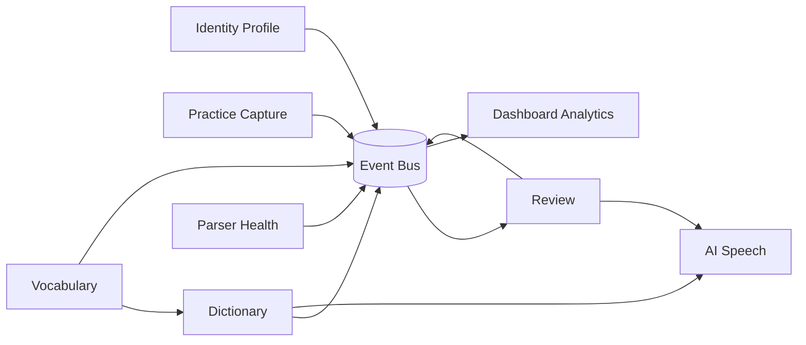
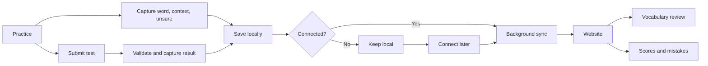
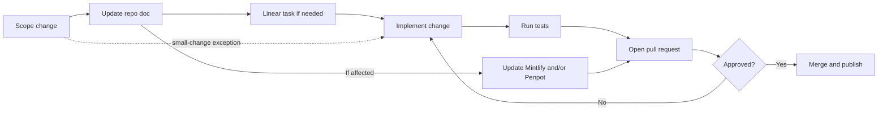

# Architecture Summary

A compact map of the IELTS extension system. See [System Architecture](./system-architecture.md), [Backend Clean Architecture](./backend-clean-architecture.md), [Microservices Architecture](./microservices-architecture.md), and [Workflow](../../workflow/index.md) for details.

## System Architecture

## Microservices

## Application Workflow

## Code And Task Workflow

