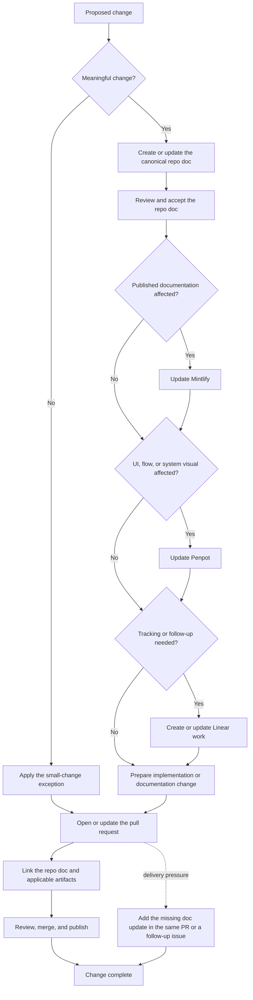
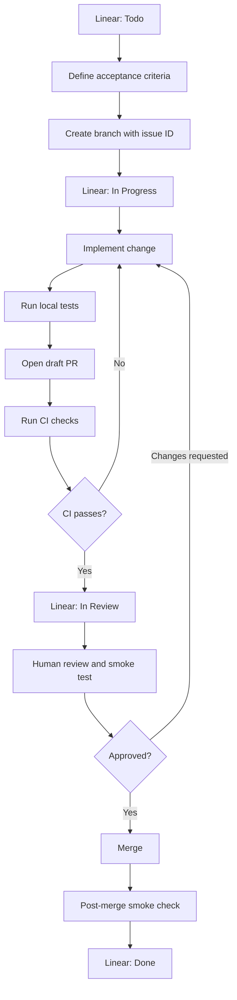

# Workflow

## Purpose

Define how planning, documentation, design, tracking, and code changes stay aligned across the repo, Mintlify, Penpot, Linear, and pull requests.

This workflow applies to both agent-driven and human-driven changes. Agents and developers should use it to decide when to update docs, create or update Linear work, refresh Penpot visuals, publish Mintlify docs, and link pull requests.

## Workflow Diagram

The repo doc remains the canonical anchor throughout the flow. Mintlify, Penpot, Linear, and the pull request are updated only when they apply, and each applicable artifact links back to the repo doc.

## Code Review And Delivery Flow

Use this flow for one human reviewing code written with agent assistance:

Recommended Linear states:

`Backlog -> Todo -> In Progress -> In Review -> Done`

Automation rules:

- Include the Linear issue ID in the branch name and pull request title.
- Move the issue to `In Progress` when its branch is created.
- Move the issue to `In Review` when the pull request is ready for review.
- Move the issue to `Done` only after merge and the applicable delivery check. If deployment is separate, use a merged state and reserve `Done` for deployment.

Merge gates:

- Protect the main branch and disallow direct pushes.
- Require lint, type checks, automated tests, and build checks that apply to the change.
- Require all review conversations to be resolved.
- Re-run CI after every review change.
- Record the human smoke-test result in the pull request.
- Prefer squash merge and delete the merged branch.

With one human, require one human approval when an agent or bot identity opens the pull request. If the human's own account is the pull request author, use a required review checklist plus green CI and recorded smoke-test evidence; self-approval is not an independent review.

References:

- [Linear GitHub integration](https://linear.app/docs/github-integration)
- [GitHub protected branches](https://docs.github.com/en/repositories/configuring-branches-and-merges-in-your-repository/managing-protected-branches/about-protected-branches)
- [GitHub pull request standards](https://docs.github.com/en/pull-requests/reference/managing-and-standardizing-pull-requests)

## Source Of Truth

Repo docs are the source of truth.

All durable product, architecture, workflow, and implementation decisions should be written in this repository first, in the Mintlify content folders. Published docs, design boards, tickets, and pull requests should point back to the relevant repo document.

## Tool Roles

### Repo Docs

Use repo docs for canonical decisions, specifications, architecture notes, workflows, domain language, and implementation context.

Repo docs should answer:
- What changed.
- Why it changed.
- What systems, screens, or workflows are affected.
- Which external references must stay aligned.

### Mintlify

Use Mintlify as the published documentation surface.

Mintlify should mirror the current approved repo docs for readers outside the repository. Mintlify should not introduce product or architecture decisions that are absent from repo docs.

### Penpot

Use Penpot for frontend, UI, system visuals, diagrams, flows, and design system references.

Penpot artifacts should reference the repo docs that define the product behavior, system boundary, or decision behind the visual.

### Linear

Use Linear as the tracking hub.

Linear issues and documents should track execution state, ownership, priority, and delivery progress. Linear should link back to the repo docs that define the scope and acceptance context.

### Pull Requests

Use pull requests to review and ship code, documentation, and configuration changes.

Every PR that changes product behavior, architecture, UI, workflows, or public documentation should link the relevant repo docs, Linear issue, and Penpot/Mintlify references when applicable.

## Linking Rule

Every meaningful change should preserve a link chain between the tools that apply:
- Repo docs.
- Mintlify page, when published.
- Penpot file or board, when UI/system visuals are involved.
- Linear issue or document, when the change needs tracking beyond the current PR.
- Pull request.

Rule of thumb: a change is meaningful when it changes behavior, product scope, architecture, UI, user-facing copy, public documentation, data contracts, operational workflow, or a decision that a teammate or future agent would need to understand.

The repo doc is the canonical anchor. Other tools should link to it, and the repo doc should include external links when those artifacts exist.

If a tool does not apply, skip that tool and keep the remaining links explicit. For example, a backend-only behavior change may need repo docs, Linear, and a PR, but no Penpot update. A docs-only clarification may need repo docs and Mintlify, but no Linear issue if the PR itself is enough tracking.

## Change Control

Follow this order for planned changes:

1. Update or create the relevant repo doc first.
2. Get the repo doc accepted or merged before treating downstream tools as canonical.
3. Update Mintlify if the change affects published documentation.
4. Update Penpot if the change affects UI, frontend flows, diagrams, or system visuals.
5. Update Linear if the change needs tracking, ownership, prioritization, or follow-up work.
6. Open or update the PR with links to the repo doc, Linear issue, and relevant Mintlify/Penpot artifacts.

Do not use Mintlify, Penpot, Linear, or a PR description as the only place where a durable decision lives.

## Exceptions

Small typo fixes, formatting-only changes, local cleanup, mechanical refactors with no behavior change, and one-file internal config changes do not need a full link chain unless they create a durable decision or follow-up work.

If production or delivery pressure requires a code or tracking change before docs are updated, create the missing repo doc update in the same PR or a follow-up issue before considering the work complete.

When in doubt, update the repo doc first. Then use only the external tools that are directly affected.
